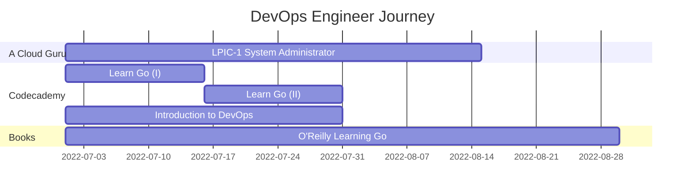
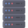

 <table>
  <tr>Infrastructure, Networking, and Security</tr>
   <td align="center"><a href="tools/admin/network.md"> <b>Networking</b></a></td>
   <td align="center"><a href="tools/admin/linux"> <b>Linux</b></a></td>
   <td align="center"><a href="tools/admin/system.md"> <b>System Design</b></a></td>
   <td align="center"><a href="tools/admin/firewall.md"> <b>pfSense</b></a></td>
   <td align="center"><a href="tools/admin/vpn.md"> <b>OpenVPN</b></a></td>
   <td align="center"><a href="tools/cloud/aws.md"> <b>AWS</b></a></td>
   <td align="center"><a href="tools/cloud/azure.md"> <b>Azure</b></a></td>
  </tr>
 </table>  
 <table>
  <tr>Programming & Command Languages</tr>
   <th width="50px;" height="50px;">Coding</th>    
   <td align="center"><a href="tools/languages/bash.md"> <b>Bash</b></a></td>
   <td align="center"><a href="tools/languages/golang.md"> <b>Golang</b></a></td>
  </tr>
 </table>

<!-- DevOps Section -->
#####  Containers & Container Orchestration

  <table>
    <tr>
       <td align="center"><a href="tools/admin/git.md"> <b>Source Control</b></a></td>
      <td align="center"><a href="tools/containers/docker.md"> <b>Docker</b></a></td>
      <td align="center"><a href="tools/containers/kubernetes.md"> <b>Kubernetes</b></a></td>
      <td align="center"><a href="tools/containers/openshift.md"> <b>OpenShift</b></a></td>
    </tr>
  </table>

<!--IaC-->

#####  Infrastructure as Code (IaC)

  <table>
    <tr>
      <td align="center"><a href="tools/iac/ansible.md"> <b>Ansible</b></a></td>
      <td align="center"><a href="tools/iac/terraform.md"> <b>Terraform</b></a></td>
    </tr>
  </table>

<!--CI/CD-->

#####  Continuous Integration / Continuous Deployment (CI/CD)

  <table>
    <tr>
      <td align="center"><a href="tools/cicd/jenkins.md"> <b>Jenkins</b></a></td>
      <td align="center"><a href="tools/cicd/githubactions.md"> <b>GitHub Actions</b></a></td>
    </tr>
  </table>

#### Monitoring & Dashboards

  <table>
    <tr>
      <td align="center"><a href="tools/monitor/grafana.md"> <b>Grafana</b></a></td>
      <td align="center"><a href="tools/monitor/prometheus.md"> <b>Prometheus</b></a></td>
      <td align="center"><a href="tools/monitor/nagios.md"> <b>Nagios</b></a></td>
    </tr>
  </table>

<!-- Works Cited -->

#### Cloud Native Computing Foundation's Landscape
Name | Comments
:------|:------:
[Cloud Native ~ Interactive Landscape](https://landscape.cncf.io/) | Categorization of cloud native open source projects as well as proprietary products.
[Cloud Native ~ Trail Map](https://raw.githubusercontent.com/cncf/trailmap/master/CNCF_TrailMap_latest.pdf) | Cloud native's recommended process of leveraging open source infrastructures.
[Cloud Native ~ Landscape Guide](https://landscape.cncf.io/guide) | Detailed guide on the use/implementation of Cloud Native's landscape.
___

## Alexander's Current Training Sites & Resources

#### LFCA Training Path
Course | Class | Platform | Complete?
:------|:------:|:------:|:------:
Introduction to Linux | [LFS101x](https://courses.edx.org/dashboard) | edX Courses | ❌
Introduction to DevOps and Site Reliability | [LFS162x](https://courses.edx.org/dashboard) | edX Courses | ❌
Introduction to Cloud Infrastructure Technologies | [LFS151x](https://courses.edx.org/dashboard) | edX Courses | ❌
A Beginners Guide to Open Source Software Development | [LFD102](https://linuxfoundation.org/) | The Linux Foundation | ❌
Open Source Licensing Basics for Software Development | [LFC191](https://linuxfoundation.org/) | The Linux Foundation | ❌
Secure Software Development: Requirements , Design, and Reuse | [LFD104x](https://linuxfoundation.org/) | The Linux Foundation | ❌
Secure Software Development: Implementation | [LFD105x](https://linuxfoundation.org/) | The Linux Foundation | ❌
Secure Software Development: Verification, and More Specialized Topics | [LFD106x](https://linuxfoundation.org/) | The Linux Foundation | ❌
Fundamentals of Open Source IT and Cloud Computing | [LFS200](https://linuxfoundation.org/) | The Linux Foundation | ❌

## DevOps Study Sites
Type | Name | Description
:------|:------:|:------:
Source Control | [Interactive Git Branching Learning](https://learngitbranching.js.org/) | Visual and interactive way to learn Git branching
Source Control | [Learn git concepts, not commands](https://dev.to/unseenwizzard/learn-git-concepts-not-commands-4gjc) | Article on Git concepts
Multiple Topics | [Katacoda](https://www.katacoda.com/) | O'Reilly's Free Courses

## DevOps Reading List
Name | Complete? | Comments
:------|:------:|:------:
[The Phoenix Project](https://www.amazon.com/Phoenix-Project-DevOps-Helping-Business/dp/1942788290) | ❌ | DevOps explained through a story of a fictional company on the brink of a failure
[The DevOps Handbook](https://www.amazon.com/dp/1942788002) | ❌ |
[Google SRE books](https://landing.google.com/sre/books) | ❌ | Very detailed books on the theory and also practice of SRE
[Essential Infrastructure as Code](https://www.manning.com/books/essential-infrastructure-as-code) | ❌ | VBook about automating software infrastructure by capturing desired configurations as a set of scripts.

## Toolkit to Study
Topic | What to learn
:------|:------
Version Control | Git
Programming | Bash, Python, Golang
Operating System | [Linux](#operating-systems)
Protocols | DHCP, UDP, TCP, HTTP, SSH, NFS, NTP, FTP
Applications | Web Server, Load Balancer, Cache, Database
System Design | Availability, Reliability, Scalability, Performance
Configuration Management and IaC | Ansible and Terraform | CM: Chef, Puppet and Salt. IaC: Pulumi and CloudFormation |
Cloud | Azure, AWS, GCP
Containers | Docker, Podman, and Kubernetes| _
CI/CD | Jenkins, GitHub Actions, Gitlab CI, Circle CI, Argo CD
Logging and Dashboards | Elastic Stack, Report Portal, Grafana, Graylog, Splunk
Monitoring | Prometheus, Nagios, Datadog
