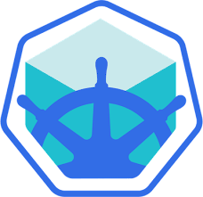
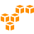

<!-- Admin Sectionhttps://training.linuxfoundation.org/ -->

  

___
### System Administration & Design / Linux / Networking

  <table>
   <tr>
   <td align="center"><a href="tools/admin/network.md"> <b>Networking</b></a></td>
   <td align="center"><a href="tools/admin/linux"> <b>Linux</b></a></td>
   <td align="center"><a href="tools/admin/system.md"> <b>System Design</b></a></td>
   <td align="center"><a href="tools/admin/git.md"> <b>Source Control</b></a></td>
   <td align="center"><a href="tools/admin/firewall.md"> <b>pfSense</b></a></td>
   <td align="center"><a href="tools/admin/vpn.md"> <b>OpenVPN</b></a></td>
   </tr>
  </table>

<!-- Programming & Scripting Section -->
___
### Programming & Command Languages

  <table>
    <tr>
    <td align="center"><a href="tools/languages/bash.md"> <b>Bash</b></a></td>
    <td align="center"><a href="tools/languages/golang.md"> <b>Golang</b></a></td>
    <td align="center"><a href="tools/languages/python.md"> <b>Python</b></a></td>
    </tr>
  </table>

<!-- DevOps Section -->
___
###  Containers & Container Orchestration

  <table>
    <tr>
      <td align="center"><a href="tools/containers/docker.md"> <b>Docker</b></a></td>
      <td align="center"><a href="tools/containers/kubernetes.md"> <b>Kubernetes</b></a></td>
      <td align="center"><a href="tools/containers/k3s.md"> <b>K3S</b></a></td>
      <td align="center"><a href="tools/containers/openshift.md"> <b>OpenShift</b></a></td>
      <td align="center"><a href="tools/containers/minikube.md"> <b>Minikube</b></a></td>
      <td align="center"><a href="tools/containers/microk8s.md"> <b>MicroK8s</b></a></td>
    </tr>
  </table>

<!--IaC-->
___
###  Infrastructure as Code (IaC)

  <table>
    <tr>
      <td align="center"><a href="tools/iac/ansible.md"> <b>Ansible</b></a></td>
      <td align="center"><a href="tools/iac/terraform.md"> <b>Terraform</b></a></td>
    </tr>
  </table>

<!--CI/CD-->
___
####  Continuous Integration / Continuous Deployment (CI/CD)

  <table>
    <tr>
      <td align="center"><a href="tools/cicd/jenkins.md"> <b>Jenkins</b></a></td>
      <td align="center"><a href="tools/cicd/githubactions.md"> <b>GitHub Actions</b></a></td>
    </tr>
  </table>

#### Monitoring & Dashboards

  <table>
    <tr>
      <td align="center"><a href="tools/monitor/grafana.md"> <b>Grafana</b></a></td>
      <td align="center"><a href="tools/monitor/prometheus.md"> <b>Prometheus</b></a></td>
      <td align="center"><a href="tools/monitor/nagios.md"> <b>Nagios</b></a></td>
    </tr>
  </table>

<!-- Cloud Section -->
___
## Cloud Platforms

  <table>
    <tr>
      <td align="center"><a href="tools/cloud/aws.md"> <b>AWS</b></a></td>
      <td align="center"><a href="tools/cloud/azure.md"> <b>Azure</b></a></td>
      <td align="center"><a href="tools/cloud/gcp.md"> <b>GCP</b></a></td>
    </tr>
  </table>

#### Cloud Native Computing Foundation's Landscape
Name | Comments
:------|:------:
[Cloud Native ~ Interactive Landscape](https://landscape.cncf.io/) | Categorization of cloud native open source projects as well as proprietary products.
[Cloud Native ~ Trail Map](https://raw.githubusercontent.com/cncf/trailmap/master/CNCF_TrailMap_latest.pdf) | Cloud native's recommended process of leveraging open source infrastructures.
[Cloud Native ~ Landscape Guide](https://landscape.cncf.io/guide) | Detailed guide on the use/implementation of Cloud Native's landscape.
___
