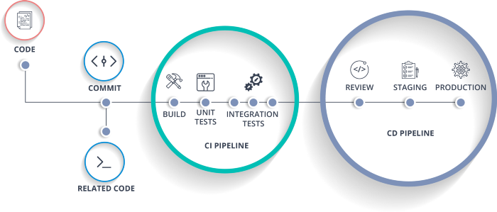

___
<!--Map-->

<!--Modules-->

 <table>
  <tr>Infrastructure, Networking, and Security</tr>
   <td align="center"><a href="tools/admin/devops.md"> <b>DevOps</b></a></td>
   <td align="center"><a href="tools/admin/linux"> <b>Linux</b></a></td>
   <td align="center"><a href="tools/cloud/aws.md"> <b>AWS</b></a></td>
   <td align="center"><a href="tools/cloud/azure.md"> <b>Azure</b></a></td>
<td align="center"><a href="tools/admin/network.md"> <b>Networking</b></a></td>
   <td align="center"><a href="tools/admin/firewall.md"> <b>pfSense</b></a></td>
   <td align="center"><a href="tools/admin/vpn.md"> <b>OpenVPN</b></a></td>
  </tr>
 </table>  
 <table>
  <tr>Languages, Containers, & Orchestration</tr>
    <td align="center"><a href="tools/languages/bash.md"> <b>Bash</b></a></td>
    <td align="center"><a href="https://github.com/HorningGit/Groudon_Go"> <b>Golang</b></a></td>
    <td align="center"><a href="tools/containers/docker.md"> <b>Docker</b></a></td>
   <td align="center"><a href="tools/containers/kubernetes.md"> <b>Kubernetes</b></a></td>
    <td align="center"><a href="tools/containers/openshift.md"> <b>OpenShift</b></a></td>
 </table>
 <table>
  <tr>Iac, SCM, CI/CD, and Monitoring</tr>
   <td align="center"><a href="tools/iac/ansible.md"> <b>Ansible</b></a></td>
   <td align="center"><a href="tools/iac/terraform.md"> <b>Terraform</b></a></td>
   <td align="center"><a href="tools/admin/git.md"> <b>SCM</b></a></td> 
   <td align="center"><a href="tools/cicd/jenkins.md"> <b>Jenkins</b></a></td>
   <td align="center"><a href="tools/monitor/grafana.md"> <b>Grafana</b></a></td>
   <td align="center"><a href="tools/monitor/prometheus.md"> <b>Prometheus</b></a></td> 
 </table> 

<!--Contact_Badges-->
___

IEEE Standard (Works Cited)
:------
“Arch Linux,” archlinux.org. [Online]. Available: https://archlinux.org/
“Gentoo Wiki,” wiki.gentoo.org. [Online]. Available: https://wiki.gentoo.org/wiki/Main_Page.
"Linuxize," linuxize.com. [Online]. Available: https://linuxize.com/
