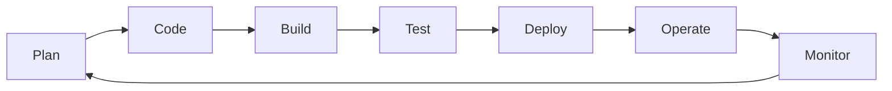
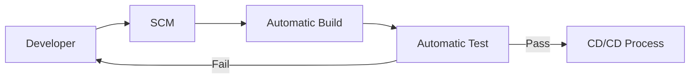

<!--DevOps_Theory-->
## DevOps Theory

<!--DevOps_Collboration-->
#### Collaboration
- DevOps is fundamentally rooted in an ethos of collaboration. Historically developers and operations have been on siloed teams creating a myriad of issues. Collaboration is the foundation of the DevOps culture. Without collaboration, there is no DevOps.

<!--DevOps_Processes-->
#### Processes
- After the ethos of collaboration has been accepted, it is mandatory to develop processes for executing the integration between teams. From a higher level perspective, we can break down these processes using the DevOps toolchain. This toolchain is a process flow template used as a reference for DevOps administrators.
<!--DevOps_Toolchain-->
###### DevOps Toolchain
<!--DevProcess_Flowchart-->

From this toolchain, we can compartmentalize these steps into several phases:
- Planning & Priority Prioritization
- Development of the Plan
- Continuous Integration
- Continuous Delivery
- Continuous Deployment
- Continuous Monitoring

##### :pineapple: Continuous Integration

##### Tools

##### CAMS Model
<!--DevOps_Toolchain-->

<!--DevOps_Methods-->
## DevOps Methods

<!--DevOps_Concepts-->
## DevOps Concepts

## Infrastructure as Code
There are five categories of IaC tools:
1. **Ad hoc scripts**
2. **Configuration Management Tools**
    - Main Tool: Ansible
    - Benefits:
      - Coding Conventions
      - Idempotence
      - Distrobution
4. **Server Templating Tools**
5. **Orchestration Tools**
6. **Provisioning Tools**

<!--DevProcess_Content-->
### :pineapple: Build Automation
* Preparing Code for Automation in a Live Environment
* Configuration Files and Scripts are placed alongside source code within the repository.
* Build automation will allow administrators to clone the repository, and be able to build it on any system (including CI/CD Server).
* Build automation is consistent which removes many errors associated with manual builds. 
1. Compiled
2. Linted
3. Minified
4. Transformed
5. Unit Tested

### :apple: Continuous Integration | Continuous Delivery | Continuous Deployment

  

### :pineapple: Software Development Process
- **Unit Test** — Evaluates the smallest possible unit of testable code, such as a single function.
- **Integration Test** — Evaluates how the units of a particular program work with one another.
- **Acceptance Test** — Evaluates whether the user experience aligns with the business requirements of the software.
- **End-to-End Test** — Evaluates the application’s behavior using production-like infrastructure that includes networking, databases, and calls to external APIs.

<!--DevProcess_Flowchart-->

