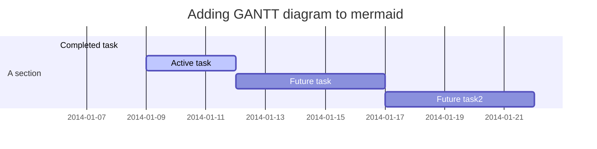
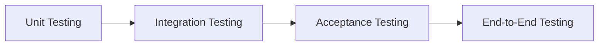
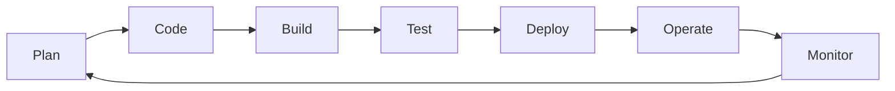

<!--DevOps_Theory-->
## DevOps Theory

<!--DevOps_Methods-->
## DevOps Methods

<!--DevOps_Concepts-->
## DevOps Concepts

<!--DevProcess_Content-->
### :pineapple: Build Automation
* Preparing Code for Automation in a Live Environment
* Configuration Files and Scripts are placed alongside source code within the repository.
* Build automation will allow administrators to clone the repository, and be able to build it on any system (including CI/CD Server).
* Build automation is consistent which removes many errors associated with manual builds. 
1. Compiled
2. Linted
3. Minified
4. Transformed
5. Unit Tested

### :pineapple: Continuous Integration
* Automatic tests such as unit tests are utilized to test code continuously.
* Configuration Files and Scripts are placed alongside source code within the repository.
* Build automation will allow administrators to clone the repository, and be able to build it on any system (including CI/CD Server).
* Build automation is consistent which removes many errors associated with manual builds. 
1. Compiled
2. Linted
3. Minified
4. Transformed
5. Unit Tested

### :pineapple: Software Development Process
- **Unit Test** — Evaluates the smallest possible unit of testable code, such as a single function.
- **Integration Test** — Evaluates how the units of a particular program work with one another.
- **Acceptance Test** — Evaluates whether the user experience aligns with the business requirements of the software.
- **End-to-End Test** — Evaluates the application’s behavior using production-like infrastructure that includes networking, databases, and calls to external APIs.

<!--DevProcess_Flowchart-->

<!--DevOps_Toolchain-->
## DevOps Toolchain
<!--DevProcess_Flowchart-->

