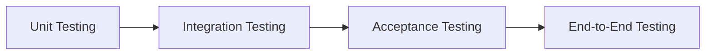

<!--DevOps_Theory-->
## DevOps Theory

<!--DevOps_Concepts-->
## DevOps Concepts
<!--DevProcess_Content-->
#### :pineapple: Software Development Process
- **Unit Test** — Evaluates the smallest possible unit of testable code, such as a single function.
- **Integration Test** — Evaluates how the units of a particular program work with one another.
- **Acceptance Test** — Evaluates whether the user experience aligns with the business requirements of the software.
- **End-to-End Test** — Evaluates the application’s behavior using production-like infrastructure that includes networking, databases, and calls to external APIs.

<!--DevProcess_Flowchart-->

