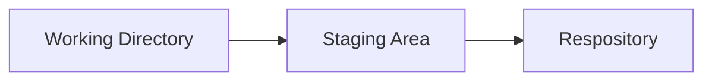

# :earth_americas: _Source Control Management_ :earth_africa:

<!--General SCM-->
### :banana: General SCM Information
Source control (or version control) is the process of managing changes to a codebaase. SCM systems provide a real-time log of code development. Here are the benefits of a Source Control Management systems:
- Tracking Code Changes
- View Revision History
- Revert to Previous Commits
- And Many More!



1. **Working Directory**
    - Addition of Code
    - Modification of Code
    - Deletion of Code
2. **Staging Area**
    - Files Ready for Commit
3. **Repository**
    - Changes are Finalized into the Repository

___
<!--Git vs GitHub-->
##### :orange: Git vs. GitHub
Many times new admins/developers will conflate Git and GitHub. While they are similar sounding, their technologies are drastically different.

**Git** is a free and open source version control system that is locally installed. It is primarily used via command line in order to achieve the benefits listed above (see General SCM Info). **GitHub** is rather a cloud-based distributed version-control platform where developers can utilize **Git** to upload to.

___
<!--Cheat Sheet-->
## :computer: Git & GitHub :computer:
### :notebook: Setup
##### :yellow_circle: Setting up Git & GitHub CLI
 - Git (Downloads): https://git-scm.com/downloads
 - GitHub CLI: https://cli.github.com/manual/


After installing GitHub CLI, run the following command to authenticate with your GitHub account:
```
$ gh auth login
```

##### :orange_circle: Initializing & Cloning Repositories


##### :red_circle: Staging & Snapshots

##### :purple_circle: Branching & Merging

##### :large_blue_circle: Sharing & Updating
- Adding a Git URL to an Alias
```
$ git remote add [alias] [url]
```
- Fetch all branches from a remote repository
```
$ git fetch [alias]
```
- Merge the remote branch to the current branch for updating
```
$ git merge [alias]/[branch]
```
- Send the local branch commits to the remote repository branch
```
$ git push [alias] [branch]
```

##### :green_circle: Monitoring
- Display commit history for current branch:
```
$ git log
```
- Display commits on _BranchA_ that are not on _BranchB_
```
$ git log BranchB..BranchA
```
- Display the difference of what is in _BranchA_ that is not in _BranchB_
```
$ git log BranchB...BranchA
```
