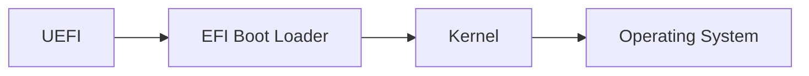

## Boot Process

<!-- Boot Process -->
___
### :see_no_evil: *Booting and System Management Daemons*
  <!-- BIOS Process -->
##### :small_blue_diamond: [Under BIOS (Basic Input/Output System)](https://wiki.archlinux.org/title/Arch_boot_process#Boot_loader)
1. The Linux system is switched on, followed by the POST (power-on-self-test) process being executed.
2. After POST, the BIOS will initialize the hardware necessary for boot (disk, keyboard controllers, etc.). The BIOS is stored on a ROM chip within the motherboard.
3. BIOS then launches the first 440 bytes of the MBR (Master Boot Record) on the first disk in the BIOS disk order. 
The Master Boot Record (MBR) is the first 512 bytes of a storage device. It contains an operating system bootloader and the storage device's partition table. It plays an important role in the boot process under BIOS systems.

4. The boot loader's first stage in the MBR boot code then launches its second stage code (if any) from either:
    * The next disk sectors after the MBR, i.e. the so called post-MBR gap (only on a MBR partition table).
    * A partition's or a partitionless disk's volume boot record (VBR).
    * BIOS Boot Partition (GRUB on BIOS/GPT only).
5. Boot loader is launched!
6. The boot loader then loads an operating system by either chain-loading or directly loading the operating system kernel. The boot loader is responsible for loading the kernel image and the initial RAM disk or filesystem into memory.

  
  <!-- UEFI Process -->
##### :small_orange_diamond: [Under UEFI (Unified Extensible Firmware Interface)](https://wiki.archlinux.org/title/Arch_boot_process#Boot_loader)
1. Linux system is switched on, followed by POST (power-on-self-test) process being executed.
2. UEFI will then initialize the hardware required for booting (disk, keyboard controllers, etc.).
3. UEFI firmware reads its Boot Manager data in Non-volatile RAM (NVRAM) to determine which EFI application to launch and what disk/partition from. 
The EFI system partition (also called ESP) is an OS independent partition that acts as the storage place for the EFI bootloaders, applications and drivers to be launched by the UEFI firmware.

4. Firmware launches the EFI application as defined in the boot entry of the firmware's boot manager.

<!-- initramfs -->
___
## :hear_no_evil: *Initial RAM Disk*
  <!-- initramfs Paragraph (1) -->
The sole purpose of initramfs is to mount the root filesystem. At boot time, the boot loader loads the Linux kernel and the initramfs image into its memory, starting the kernel. The initramfs filesystem image will provide kernel functionality for the Linux filesystem, and will manage device drivers for mass storage controllers with a facility called udev (user device). Here is a list of initramfs responsibilities:
<!-- initramfs image -->

  

<!-- initramfs Paragraph (2) -->
The mount program will then notify the Linux OS that the filesystem is ready for use using the mount point. If succesful, initramfs is cleared from RAM and the init program on the root filesystem (/sbin/init) is executed.
