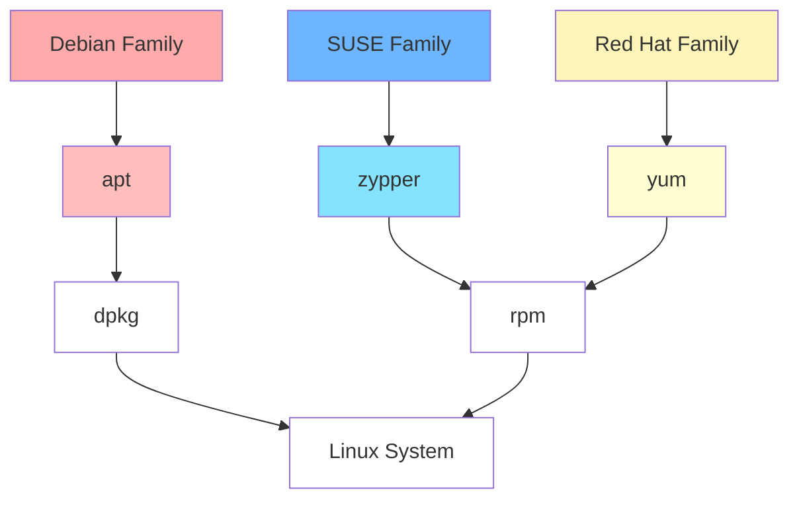

<!--PKGMANAGE_COMMANDS-->
##### :small_blue_diamond: Package Management Commands for RPM / DEB

```
[Install]                              [RPM]                                  [DEB]                                         
Install Package                        rpm -i packagename.rpm                 dpkg --install packagename.deb
Install Package; dependencies          dnf install packagename                apt-get install packagename  

[Remove]                               [RPM]                                  [DEB]
Remove Package                         rpm -e packagename.rpm                 dpkg --remove packagename.deb
Remove Package; dependencies           dnf remove packagename                 apt-get autoremove packagename

[Update]                               [RPM]                                  [DEB]                                         
Update Package                         rpm -U packagename.rpm                 dpkg --install packagename.deb
Update Package; dependencies           dnf update packagename                 apt-get install packagename
Update Entire System                   dnf update                             apt-get dist-upgrade

[List]                                 [RPM]                                  [DEB]
Show All Listed Packages               dnf list installed                     dpkg --list
Retrieve Package info                  rpm -qil packagename                   dpkg --listfiles packagename
Show Available Package "Name"          dnf list "packagename"                 apt-cache search packagename
```
